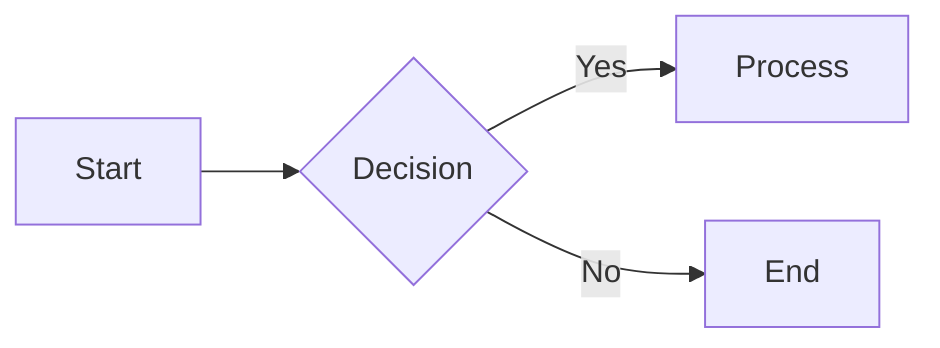

Comprehensive reference guide for all Mintlify components available in this documentation system. This guide is alphabetically organized for easy navigation when writing documentation.

## Accordion, API Components

### Accordion Component

Used for collapsible content sections that can be expanded or collapsed by the user.

```mdx
<Accordion title="Accordion Title">
  Content that can be expanded/collapsed
  Can include other components inside
</Accordion>

<AccordionGroup>
  <Accordion title="Title 1">Content 1</Accordion>
  <Accordion title="Title 2" icon="alien-8bit">Content 2</Accordion>
</AccordionGroup>
```

### API Documentation Components

#### ParamField

```mdx
<ParamField path="param" type="string" required>
  Parameter description
</ParamField>

<ParamField path="param" type="object">
  <Expandable title="properties">
    <ParamField path="subParam" type="string">
      Sub-parameter description
    </ParamField>
  </Expandable>
</ParamField>
```

#### RequestExample & ResponseExample

````mdx
<RequestExample>
  ```bash Request
  curl --request POST \
    --url https://api.example.com/endpoint
  ```
</RequestExample>

<ResponseExample>
  ```json Response
  { "status": "success" }
  ```
</ResponseExample>
````

#### ResponseField

```mdx
<ResponseField name="response" type="string" required>
  Response description
</ResponseField>

<ResponseField name="data" type="Object">
  <Expandable title="properties">
    <ResponseField name="field" type="string">
      Field description
    </ResponseField>
  </Expandable>
</ResponseField>
```

## Badge

Used for highlighting labels, status indicators, or categories.

```mdx
<!-- Basic badge -->

<Badge>Badge</Badge>

<!-- With color -->

<Badge color="blue">Blue</Badge>
<Badge color="green">Green</Badge>
<Badge color="red">Red</Badge>

<!-- With size -->

<Badge size="xs">Extra Small</Badge>
<Badge size="sm">Small</Badge>
<Badge size="lg">Large</Badge>

<!-- With shape -->

<Badge shape="rounded">Rounded</Badge>
<Badge shape="pill">Pill</Badge>

<!-- With icon -->

<Badge icon="star" color="blue">
  Starred
</Badge>

<!-- Stroke variant -->

<Badge stroke color="green">
  Stroke
</Badge>

<!-- Disabled -->

<Badge disabled>Disabled</Badge>

<!-- Inline usage -->

This requires <Badge color="orange" size="sm">Premium</Badge> access.
```

## Callout Components, Card, CodeBlock, CodeGroup, Color, Columns

### Callout Components

Used for highlighting important information with visual emphasis.

```mdx
<Note>Note content</Note>
<Warning>Warning content</Warning>
<Info>Info content</Info>
<Tip>Tip content</Tip>
<Check>Check content</Check>
<Danger>Danger content</Danger>

<!-- Custom callout -->

<Callout icon="key" color="#FFC107" iconType="regular">
  Custom callout content
</Callout>
```

### Card Component

Used for presenting content in a card layout with optional icons, links, and actions.

```mdx
<!-- Basic card -->

<Card title="Title" icon="rocket" href="/link">
  Card content
</Card>

<!-- Horizontal card -->

<Card title="Title" horizontal>
  Content
</Card>

<!-- Image card -->

<Card title="Title" img="/image.jpg">
  Content
</Card>

<!-- Card with custom CTA -->

<Card title="Title" href="/link" arrow="true" cta="Click here">
  Content
</Card>
```

### CodeBlock

Standard code blocks with optional metadata for enhanced presentation.

````mdx
```javascript title="Example" icon="js" lines highlight={1,2}
const greeting = "Hello, World!";
console.log(greeting);
```
````

````

**Meta options:**
- `title="Title"` - Display title for the code block
- `icon="icon-name"` - Show icon next to title
- `lines` - Show line numbers
- `highlight={1,2,5}` - Highlight specific lines
- `focus={2,4-5}` - Focus on specific lines
- `expandable` - Make long code collapsible
- `wrap` - Enable text wrapping
- `diff` - Show added/removed lines with `// [!code ++]`

### CodeGroup Component

Groups multiple code blocks together, allowing users to switch between different language implementations or approaches.

````mdx
<CodeGroup>
  ```javascript helloWorld.js
  console.log("Hello World");
  ```

  ```python hello_world.py
  print('Hello World!')
  ```
</CodeGroup>
````

### Color Component

Displays color palettes and design tokens in either compact or table format.

```mdx
<!-- Compact variant -->

<Color variant="compact">
  <Color.Item name="blue-500" value="#3B82F6" />
  <Color.Item name="blue-600" value="#2563EB" />
</Color>

<!-- Table variant -->

<Color variant="table">
  <Color.Row title="Primary">
    <Color.Item name="primary-500" value="#3B82F6" />
    <Color.Item name="primary-600" value="#2563EB" />
  </Color.Row>
</Color>

<!-- Theme-aware colors -->

<Color variant="compact">
  <Color.Item name="bg-primary" value={{ light: "#FFFFFF", dark: "#000000" }} />
</Color>
```

### Columns Component

Creates responsive column layouts for organizing content side by side.

```mdx
<Columns cols={2}>
  <Card title="Card 1">Content</Card>
  <Card title="Card 2">Content</Card>
</Columns>

<Columns cols={3}>
  <!-- Three columns -->
</Columns>
```

## Expandable

Used for nesting expandable content within other components, particularly in API documentation.

```mdx
<ResponseField name="user" type="User Object">
  <Expandable title="properties">
    <ResponseField name="name" type="string">
      User name
    </ResponseField>
  </Expandable>
</ResponseField>
```

## Frame, File Components

### Frame Component

Wraps content in a bordered frame with optional captions and hints.

```html
<Frame>
  
</Frame>

<Frame caption="Caption text">
  
</Frame>

<Frame hint="Hint text" caption="Caption text">
  
</Frame>
```

## Icon, Image, iframe

### Icon Component

Displays inline icons with customizable size and color.

```mdx
<!-- Basic icon -->

<Icon icon="flag" size={32} />

<!-- With color -->

<Icon icon="flag" color="#FF5733" />

<!-- With type -->

<Icon icon="flag" iconType="solid" />

<!-- Inline usage -->

Text with <Icon icon="flag" /> icon inline
```

### Images

Standard Markdown images with additional HTML attributes for enhanced control.

```mdx


<!-- HTML Image Embeds -->

/>

<!-- Light/Dark Mode Images -->
<!-- Light mode -->


<!-- Dark mode -->


```

### iframes

Embed external content in your documentation.

```html
<iframe
  src="https://example.com/embed"
  title="Embedded content"
  className="w-full h-96 rounded-xl"
></iframe>
```

## Lists

### Ordered and Unordered Lists

```mdx
1. Ordered list item
2. Second item
- Unordered list item
- Nested item (indented)

* Alternative unordered syntax
+ Plus sign syntax
```

## Mermaid, Media Components

### Mermaid Diagrams

Create flowcharts, sequence diagrams, and other visualizations using Mermaid syntax.

````mdx

````

````

### Media Components

#### Videos
```html
<!-- YouTube -->
<iframe
  className="w-full aspect-video rounded-xl"
  src="https://www.youtube.com/embed/4KzFe50RQkQ"
  title="Video player"
  allowFullScreen
></iframe>

<!-- Self-hosted -->
<video
  controls
  className="w-full aspect-video rounded-xl"
  src="/video.mp4"
></video>

<!-- Autoplay -->
<video
  autoPlay
  muted
  loop
  playsInline
  className="w-full aspect-video rounded-xl"
  src="/video.mp4"
></video>
````

## Panel, Text Formatting

### Panel Component

Creates side panels for additional information or context.

```mdx
<Panel>
  <Info>Content in side panel</Info>
</Panel>
```

### Text Formatting

#### Headers

```mdx
## Main section header

### Subsection header

#### Sub-subsection header

<!-- Disable anchors -->

<h2 noAnchor>No anchor header</h2>
<Heading level={2} noAnchor>
  No anchor heading
</Heading>
```

#### Basic Text Formatting

```mdx
**Bold text**
_Italic text_
~~Strikethrough text~~
```

#### Mathematical Expressions

```mdx
Inline: $(a^2 + b^2 = c^2)$
Block:

$$
E = mc^2
$$
```

#### Links

```mdx
[Internal link](/path/to/page)
[External link](https://example.com)
```

#### Blockquotes

```mdx
> Single line blockquote
>
> Multi-line blockquote
> with paragraph breaks
```

## Steps Component, Superscript & Subscript

### Steps Component

Creates step-by-step tutorials and guides with numbered steps.

```mdx
<Steps>
  <Step title="Step 1">
    Instructions for step 1
  </Step>
  <Step title="Step 2">
    Instructions for step 2
  </Step>
</Steps>
```

### Superscript & Subscript

```html
<sup>text</sup>    <!-- Superscript -->
<sub>text</sub>    <!-- Subscript -->
```

## Tabs, Tables, Tile Component, Tooltip Component, Tree Component

### Tabs Component

Organizes content into tabbed sections for better organization.

```mdx
<Tabs>
  <Tab title="First tab">
    Content for first tab
    Can include other components
  </Tab>
  <Tab title="Second tab" icon="leaf">
    Content with icon
  </Tab>
</Tabs>
```

### Tables

```mdx
| Header 1 | Header 2 | Description |
| -------- | -------- | ----------- |
| Content  | Value    | Description |
```

### Tile Component

Grid-based layout for showcasing multiple items with previews.

```mdx
<Tile href="/link" title="Title" description="Description">
  
</Tile>
```

### Tooltip Component

Provides additional context on hover or click with optional actions.

```mdx
<Tooltip
  headline="API"
  tip="Application Programming Interface definition"
  cta="Learn more"
  href="/api"
>
  API
</Tooltip>
```

### Tree Component

Displays file system structures or hierarchical data in a tree format.

```mdx
<Tree>
  <Tree.Folder name="app" defaultOpen>
    <Tree.File name="page.tsx" />
    <Tree.Folder name="api">
      <Tree.File name="route.ts" />
    </Tree.Folder>
  </Tree.Folder>
  <Tree.File name="package.json" />
</Tree>
```

## Update Component

Used for changelog entries and release notes with optional RSS support.

```mdx
<Update label="March 2025" description="v1.0.0">
  ## New Feature

Description of new feature

### Changes
  - Added functionality
  - Fixed bug
</Update>

<Update label="February 2025" description="v0.9.0" tags={["Feature"]}>
  Update with tags
</Update>

<Update
  label="January 2025"
  description="v0.8.0"
  rss={{
    title: "January 2025 Updates",
    description: "Monthly release notes",
  }}
>
  Update with custom RSS content
</Update>
```

## View Component

Displays content conditionally based on context or user preferences.

```mdx
<View title="JavaScript" icon="js">
  JavaScript-specific content
</View>

<View title="Python" icon="python">
  Python-specific content
</View>
```

## Installation Pattern

Standard installation template for packages:

````mdx
<CodeGroup>
  ```bash npm
  npm install @pelatform/package-name
  ```

  ```bash yarn
  yarn add @pelatform/package-name
  ```

  ```bash pnpm
  pnpm add @pelatform/package-name
  ```

  ```bash bun
  bun add @pelatform/package-name
  ```
</CodeGroup>
````

## Common Patterns

### Sequential Tutorial Structure

````mdx
<Steps>
  <Step title="Install Package">
    Install the package using your preferred package manager:

    <CodeGroup>
      ```bash npm
      npm install @pelatform/package
      ```
      ```bash yarn
      yarn add @pelatform/package
      ```
      ```bash pnpm
      pnpm add @pelatform/package
      ```
      ```bash bun
      bun add @pelatform/package
      ```
    </CodeGroup>

  </Step>

  <Step title="Configure">
    Configure the package in your project:

    ```js filename="config.js"
    import { configure } from '@pelatform/package';

    configure({
      // options here
    });
    ```

  </Step>
</Steps>
````

### Feature Showcase with Cards

```mdx
<Cards>
  <Card title="Feature One" icon="zap">
    Description of the first feature with icon
  </Card>
  <Card title="Feature Two" icon="shield-check">
    Description of the second feature with icon
  </Card>
</Cards>
```

## Best Practices

### Component Usage Guidelines

- **Installation**: Always use `CodeGroup` with all package managers (npm, yarn, pnpm, bun)
- **Tutorials**: Use `Steps` for sequential setup guides and tutorials
- **Features**: Use `Cards` for showcasing features and capabilities
- **Organization**: Use `Tabs` for organizing different approaches or variations
- **Emphasis**: Use appropriate `Callouts` (Note, Warning, Tip, Info, Check, Danger)
- **Advanced Content**: Use `Accordion` for optional or advanced information
- **Code Examples**: Always specify language and optional filename for code blocks

### Content Organization

- Start with clear description and purpose
- Group related information under clear headings
- Use callouts to highlight important information
- Provide both basic and advanced examples
- Include troubleshooting sections when applicable
- Maintain consistency in styling and naming conventions

### Accessibility

- Include descriptive alt text for all images
- Use semantic HTML structure
- Ensure color contrast is sufficient
- Provide keyboard navigation support where applicable
